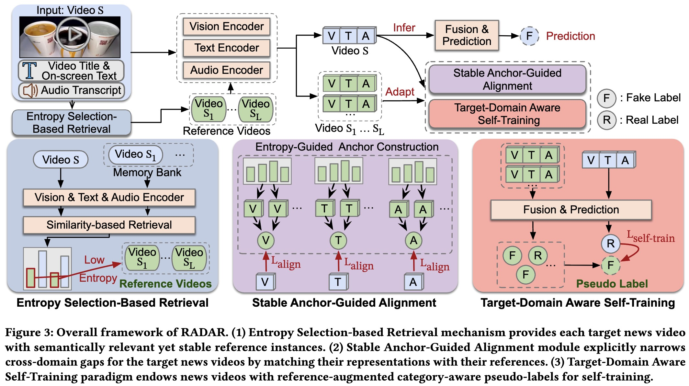

# RADAR: Retrieval-Augmented Distribution Alignment and target-aware self-tRaining framework 


This repo provides official implementations for RADAR proposed in the paper: *Nip Rumors in the Bud: Retrieval-Guided Topic-Level Adaptation for Test-Time Fake News Video Detection* accepted by KDD 2026. This study pioneers a *Test-Time Adaptation* (TTA) research direction for Fake News Video Detection and proposes an effective solution. Paper is available from [arxiv](https://arxiv.org/abs/2601.11981).

## Abstract

Fake News Video Detection (FNVD) is critical for social stability. Existing methods typically assume consistent news topic distribution between training and test phases, failing to detect fake news videos tied to emerging events and unseen topics. To bridge this gap, we introduce RADAR, the first framework that enables test-time adaptation to unseen news videos. RADAR pioneers a new retrieval-guided adaptation paradigm that leverages stable (source-close) videos from the target domain to guide robust adaptation of semantically related but unstable instances. Specifically, we propose an Entropy Selection-Based Retrieval mechanism that provides videos with stable (low-entropy), relevant references for adaptation. We also introduce a Stable Anchor-Guided Alignment module that explicitly aligns unstable instances' representations to the source domain via distribution-level matching with their stable references, mitigating severe domain discrepancies. Finally, our novel Target-Domain Aware Self-Training paradigm can generate informative pseudo-labels augmented by stable references, capturing varying and imbalanced category distributions in the target domain and enabling RADAR to adapt to the fast-changing label distributions. Extensive experiments demonstrate that RADAR achieves an average Macro-F1 improvement of 6.55% over existing methods, with strong on-the-fly adaptation to unseen fake news video topics.


## Framework




## Code Structure

```sh
├── core                # main code
│   ├── adapt_model
│   │   └──RADAR        # framework of RADAR
│   ├── adapt.py        # pipeline for adaptation
│   ├── model           # framework of Source model
│   ├── train.py        # pipeline for training
│   └── utils
├── data                # folder for three datasets
│   ├── FakeSV
│   ├── FakeTT
│   └── FVC 
└── run                 # shell scripts for running code
```

## Prepare

### Dataset

Due to copyright restrictions, the raw datasets are not included. You can obtain the datasets from their respective original project sites.

+ [FakeSV](https://github.com/ICTMCG/FakeSV)
+ [FakeTT](https://github.com/ICTMCG/FakingRecipe)
+ [FVC](https://github.com/MKLab-ITI/fake-video-corpus)

### Requirements

To set up the environment, run the following commands:

```sh
conda create --name RADAR python=3.12
conda activate RADAR
pip install -r requirements.txt
```

### Preprocess

1. Download datasets and store them in `data` as presented in Code Structure, and save videos to `videos` in the corresponding dataset path.
2. For video dataset, save `data.jsonl` in each dataset path, with each line including vid, title, ocr, transcript, event, and label. And evenly sample 16 frames for each video, store them in `frames_16` in each dataset path.
3. Run the following codes to extract features for data:

```sh
# prepare feature for source model
bash run/preprocess_feature.sh
```

## Run

### Train Source Model
```sh
# train source model on source domain dataset.
# Use FakeTT dataset for example.
python core/train.py --config Backbone_FakeTT
```

### Adapt Using Our RADAR
```sh
# adapt source model to target domain using Our RADAR
# take from Source dataset FakeTT to Target dataset FakeSV for example.
python core/adapt.py --config-name RADAR_FakeTT2FakeSV
# use event-wise setting
python core/adapt.py --config-name RADAR_event_FakeTT2FakeSV
```

